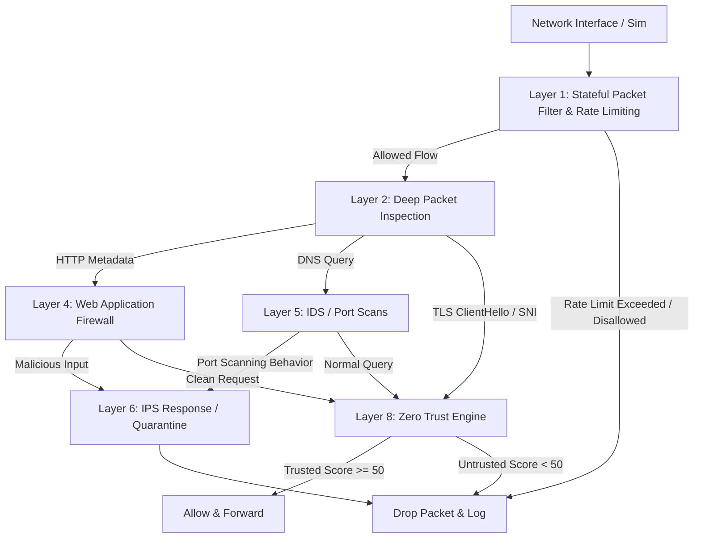

# Project Sentinel-X

Project Sentinel-X is an enterprise-grade autonomous multi-layer adaptive firewall platform. Written in high-performance C, it implements an active defense mechanism mapping to several critical stages of the network security posture.

---

## Architecture Flow



---

## Features Implemented

1. **Layer 1: Stateful Packet Filtering & Rate Limiting**
   - Keeps track of TCP connections (SYN, ESTABLISHED, FIN/RST states), UDP flows, and ICMP queries.
   - Dynamic token-bucket rate limiting per source IP to mitigate flood-based DDoS attacks.
2. **Layer 2: Deep Packet Inspection (DPI)**
   - Custom HTTP parser extracting request method, URI, Host, and User-Agent.
   - Custom DNS parser reading QNAME queries and query type.
   - Custom TLS ClientHello parser extracting SNI hostname and version safely.
3. **Layer 4: Web Application Firewall (WAF)**
   - Regex-like case-insensitive signatures matching SQL Injection, Cross-Site Scripting (XSS), Command Injection, and Path Traversal exploits.
4. **Layer 5 & 6: Intrusion Detection & Prevention (IDS/IPS)**
   - Automatic vertical and horizontal port scan heuristic identification.
   - Active response system quarantining attacking IPs for 60 seconds (active packet drops).
5. **Layer 8: Zero Trust Engine**
   - Dynamic user/device trust scoring (starts at 80, drops upon anomaly detection, elevates up to 100 on identity provider authentication).

---

## Compilation and Run

### Requirements
- CMake 3.10+
- GCC or Clang (supporting C17 standard)
- pthread support

### Build Instructions
Build the project using standard CMake tools:
```bash
cmake -B build -S .
cmake --build build
```

### Execution
Run the integrated end-to-end simulation runner:
```bash
./build/sentinel_x
```

---

## API Documentation

### 1. Common Utility Library (`sentinel_common.h`)
- `HashMap *hashmap_create(size_t size)`: Allocates and returns a thread-safe fine-grained locked hashmap.
- `bool hashmap_put(HashMap *map, const char *key, void *value)`: Safe insert.
- `void *hashmap_get(HashMap *map, const char *key)`: Safe read.
- `bool hashmap_remove(HashMap *map, const char *key, void (*free_val_fn)(void *))`: Removes an entry.

### 2. Core Engine (`sentinel_core.h`)
- `FirewallEngine *sentinel_engine_create(uint32_t limit_rate, uint32_t limit_burst)`: Initializes core filter.
- `bool sentinel_add_rule(FirewallEngine *engine, const char *src_ip, ...)`: Configures rules database.
- `bool sentinel_process_packet(FirewallEngine *engine, Packet *packet, char *reason, size_t len)`: Core rule matching, rate limiting, and stateful connection checks.

### 3. DPI Engine (`sentinel_dpi.h`)
- `bool sentinel_dpi_inspect(const Packet *packet, DpiResult *result)`: Parses transport payload to extract application-layer structures.

### 4. WAF Engine (`sentinel_waf.h`)
- `bool sentinel_waf_inspect(const HttpMeta *http, char *block_reason, size_t reason_len)`: Scans parsed HTTP headers for exploit payloads.

### 5. IDS/IPS Engine (`sentinel_ids_ips.h`)
- `bool sentinel_ids_ips_process(IdsIpsEngine *engine, const Packet *packet, char *alert_msg, size_t msg_len)`: Identifies reconnaissance and drops packets from quarantined sources.

### 6. Zero Trust Engine (`sentinel_zero_trust.h`)
- `bool sentinel_zt_evaluate(ZeroTrustEngine *engine, const Packet *packet, char *reason, size_t len)`: Evaluates dynamic trust requirements.
- `void sentinel_zt_penalize(ZeroTrustEngine *engine, const char *ip_address, int points, const char *reason)`: Drops scores for suspicious traffic.

---

## Deployment & Containerization

### Docker Build
```bash
docker build -t sentinel-x -f docker/Dockerfile .
```

### Docker Compose
```bash
docker-compose -f docker/docker-compose.yml up --build
```

---

## Threat Model

| Asset | Threat | Mitigation | Risk Level |
|---|---|---|---|
| Web Application Services | SQLi, XSS, Cmd Injection | Layer 4 WAF Signature Engine | High -> Mitigated |
| System Infrastructure | DDoS and Syn Flooding | Layer 1 Token-bucket Rate Limiter | High -> Mitigated |
| Internal Server Resources | Port scanning / Reconnaissance | Layer 5/6 IPS Port Scan Detection & Active Quarantine | Medium -> Mitigated |
| Access Privilege | Compromised Device / Credential theft | Layer 8 Zero Trust Scoring & MFA validation | High -> Mitigated |

---

## Performance Benchmarks

The core engines are designed with speed-optimized components to reduce latency:
- **Lock Contention**: Solved using bucket-level fine-grained locking (`pthread_mutex_t`) instead of global hashmap locking, achieving concurrent processing.
- **DPI Memory Allocations**: Built zero-copy parsers referencing original buffer offsets or static-sized memory limits.
- **Static Rules Engine**: Average rule matching overhead: $O(N)$ with respect to active rules, optimized with hash lookups for state connections ($O(1)$ lookup).
# sentinel-x
